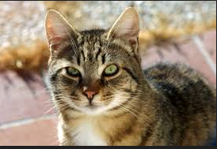
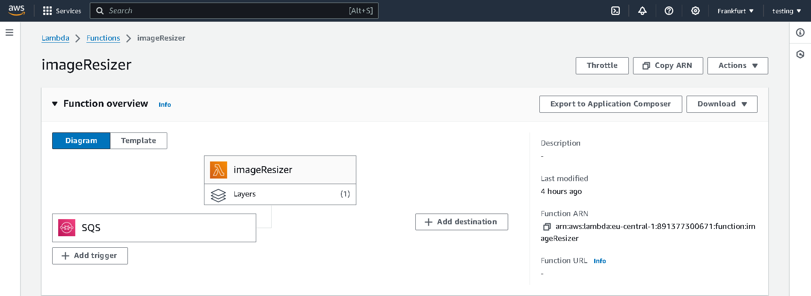

# Serverless image resizer application in AWS Cloud  


This is serverless event-driven application which takes any images from S3 bucket and resizes it to one of 3 types (Profile, Cover, Post) and pushes to another S3 bucket. All lambda logs are saved into CloudWatch service.  
Practically it works like this - S3 bucket which receives images to resize is configured to push S3 notification events to aws sqs queue. Then lambda function has configured trigger to listen to events from SQS queue and after receiving message from this queue (which is image), uses lambda code to resize image and upload to another S3 bucket.  


# Get started:  

#### Init:  
```bash
sudo apt install zip -y
export AWS_REGION=eu-central-1
export S3_INITIAL_BUCKET_NAME=media-app-initial-image-rafal
export S3_RESIZED_BUCKET_NAME=media-app-resized-image-rafal
export AWS_ACCOUNT_ID=$(aws sts get-caller-identity --query Account --output text)
```

#### Create S3 buckets:  
```bash
aws s3api create-bucket --bucket $S3_INITIAL_BUCKET_NAME --create-bucket-configuration LocationConstraint=eu-central-1 --region $AWS_REGION
aws s3api create-bucket --bucket $S3_RESIZED_BUCKET_NAME --create-bucket-configuration LocationConstraint=eu-central-1 --region $AWS_REGION
aws s3api put-object --bucket media-app-initial-image-rafal --key Cover/
aws s3api put-object --bucket media-app-initial-image-rafal --key Post/
aws s3api put-object --bucket media-app-initial-image-rafal --key Profile/
```

#### Add bucket policy to allow Lambda function operate on both S3 buckets. (IAM Policy to lambda role is not enough!):  
```bash
aws s3api put-bucket-policy --bucket $S3_RESIZED_BUCKET_NAME  --policy file://bucket-resource-based-policies/MediaAppResizedImagePolicy.json
aws s3api put-bucket-policy --bucket $S3_RESIZED_BUCKET_NAME  --policy file://bucket-resource-based-policies/MediaAppInitialImagePolicy.json
```

#### Create SQS queue to fetch S3 notification event and supply lambda function:  
```bash
aws sqs create-queue --queue-name media-app-queue --region $AWS_REGION
QUEUE_URL=$(aws sqs get-queue-url --queue-name media-app-queue --query 'QueueUrl' --output text)
QUEUE_ARN=$(aws sqs get-queue-attributes --queue-url $QUEUE_URL --attribute-names QueueArn --query 'Attributes.QueueArn' --output text)
```

#### Create access policy to allow S3 bucket access sqs queue.  
```bash
cat >> sqs-policy.json << EOF
{
  "Version": "2012-10-17",
  "Id": "Policy167996637916633",
  "Statement": [
    {
      "Sid": "Stmt167996637744733",
      "Effect": "Allow",
      "Principal": "*",
      "Action": "sqs:*",
      "Resource": "$QUEUE_ARN",
      "Condition": {
        "ArnEquals": {
          "aws:SourceArn": "arn:aws:s3:::$S3_INITIAL_BUCKET_NAME"
        }
      }
    }
  ]
}
EOF
```
I've created python script which transform json file into string which can be passed as argument in CLI.
Run script to transform json file into string to pass it as argument:  

```bash
# Run script
python3 transform-json-file-to-cli-argument.py sqs-policy.json
# Run output, similiar to this:
aws sqs set-queue-attributes --queue-url $QUEUE_URL --attributes ' {"Policy": "{\"Version\": \"2012-10-17\", \"Id\": \"Policy1679966379166\", \"Statement\": [{\"Sid\": \"Stmt167996637744733\", \"Effect\": \"Allow\", \"Principal\": \"*\", \"Action\": \"sqs:SendMessage\", \"Resource\": \"arn:aws:sqs:eu-central-1:891377300671:media-app-queue\", \"Condition\": {\"ArnEquals\": {\"aws:SourceArn\": \"arn:aws:s3:::media-app-initial-image-rafal\"}}}]}"} '
```

#### Create notification event for S3 bucket to send events to SQS. 
If some event appears on S3 bucket, e.g. new image has been uploaded, then bucket emits event which sends to SQS.   

```bash
cat >> s3-notification.json << EOF
{
    "QueueConfigurations": [
        {
        "QueueArn": "$QUEUE_ARN",
        "Events": ["s3:ObjectCreated:*"]
        }
    ]
}
EOF
aws s3api put-bucket-notification-configuration --bucket $S3_INITIAL_BUCKET_NAME --notification-configuration file://s3-notification.json
```

#### Create IAM Policies to attach to IAM role used by Lambda:  
```bash
cat >> iam-policies/MediaAppQueueAccessPolicy.json << EOF
{
    "Version": "2012-10-17",
    "Statement": [
        {
            "Sid": "ListAllQueues",
            "Effect": "Allow",
            "Action": "sqs:ListQueues",
            "Resource": "*"
        },
        {
            "Sid": "ReadAceessMediaAppQueue",
            "Effect": "Allow",
            "Action": [
                "sqs:GetQueueUrl",
                "sqs:ListDeadLetterSourceQueues",
                "sqs:ReceiveMessage",
                "sqs:GetQueueAttributes",
                "sqs:ListQueueTags",
                "sqs:ReceiveMessage",
                "sqs:DeleteMessage",
                "sqs:GetQueueAttributes",
                "sqs:GetQueueUrl"
            ],
            "Resource": "arn:aws:sqs:eu-central-1:891377300671:media-app-queue"
        }
    ]
}

EOF

cat >> iam-policies/MediaAppBucketAccessPolicy.json << EOF
{
    "Version": "2012-10-17",
    "Statement": [
        {
            "Effect": "Allow",
            "Action": "s3:*",
            "Resource": [
                "arn:aws:s3:::$S3_INITIAL_BUCKET_NAME",
                "arn:aws:s3:::$S3_INITIAL_BUCKET_NAME/*",
                "arn:aws:s3:::$S3_RESIZED_BUCKET_NAME",
                "arn:aws:s3:::$S3_RESIZED_BUCKET_NAME/*"
            ]
        }
    ]
}
EOF

aws iam create-policy --policy-name MediaAppQueueAccessPolicy --policy-document file://iam-policies/MediaAppQueueAccessPolicy.json
aws iam create-policy --policy-name MediaAppBucketAccessPolicy --policy-document file://iam-policies/MediaAppBucketAccessPolicy.json
# These one below already exists
aws iam create-policy --policy-name WriteCloudWatchLogs --policy-document file://iam-policies/WriteCloudWatchLogs.json
```

#### Create Lambda Role and attach previous IAM Policies:  
```bash
aws iam create-role --role-name ImageResizerLambdaRole --assume-role-policy-document '{
    "Version": "2012-10-17",
    "Statement": [
        {
            "Effect": "Allow",
            "Principal": {
                "Service": "lambda.amazonaws.com"
            },
            "Action": "sts:AssumeRole"
        }
    ]
}'

aws iam attach-role-policy --role-name ImageResizerLambdaRole --policy-arn arn:aws:iam::aws:policy/service-role/AWSLambdaBasicExecutionRole
aws iam attach-role-policy --role-name ImageResizerLambdaRole --policy-arn arn:aws:iam::$AWS_ACCOUNT_ID:policy/WriteCloudWatchLogs
aws iam attach-role-policy --role-name ImageResizerLambdaRole --policy-arn arn:aws:iam::$AWS_ACCOUNT_ID:policy/MediaAppBucketAccessPolicy
aws iam attach-role-policy --role-name ImageResizerLambdaRole --policy-arn arn:aws:iam::$AWS_ACCOUNT_ID:policy/MediaAppQueueAccessPolicy
```

#### Zip lambda function code:  
```bash
cat >> lambda_function.py << EOF
import json
import boto3
from io import BytesIO
from PIL import Image

client = boto3.client('s3')
destination_bucket = "$S3_RESIZED_BUCKET_NAME"
exclude_keys = {'Cover/', 'Post/', 'Profile/'}

# Custom Image Size
image_sizes = {
    'Cover': (820, 360),
    'Profile': (170, 170),
    'Post': (1080, 1080)
}

def resizer(img, key):
    image_type = key.split("/")[0]
    if image_type in image_sizes:
        resized_image = img.resize(image_sizes[image_type])
        temp_buffer = BytesIO()
        resized_image.save(temp_buffer,format=img.format)
        resized_bytes = temp_buffer.getvalue()
        client.put_object(Body=resized_bytes, Bucket=destination_bucket, Key=key)

def download_image(bucket_name, key):
    response = client.get_object(Bucket=bucket_name, Key=key)
    return response['Body'].read()

def lambda_handler(event, context):
    print(event)
    try:
        
        for item in event['Records']:
            
            s3_event = json.loads(item['body'])
            
            if 'Event' in s3_event and s3_event['Event'] == 's3:TestEvent':
                print("Test Event")
                
            else:
                for item in s3_event['Records']:
                    source_bucket = item['s3']['bucket']['name']
                    key = item['s3']['object']['key']
                    print(key)
                    
                    if key not in exclude_keys:
                        image_content = download_image(source_bucket, key)
                        with Image.open(BytesIO(image_content)) as img:
                            img.format
                            resizer(img, key)
                        
    except Exception as exception:
        print(exception)
EOF
zip function.zip lambda_function.py
```

#### Create lambda:  
```bash
aws lambda create-function --function-name imageResizer --runtime python3.9 --role arn:aws:iam::$AWS_ACCOUNT_ID:role/ImageResizerLambdaRole --handler lambda_function.lambda_handler --zip-file fileb://function.zip --architectures x86_64
```

#### Create trigger for lambda to be launched every time it receives event from SQS:  
```bash
aws lambda create-event-source-mapping --function-name imageResizer --batch-size 1 --event-source-arn $QUEUE_ARN
```

#### Create layer for lambda containing `Pillow` package to resize images:  
```bash
export AWS_ACCOUNT_ARN=$(aws sts get-caller-identity | jq .Arn)
aws lambda add-layer-version-permission \
    --layer-name Klayers-p39-pillow \
    --version-number 1 \
    --statement-id allow-admin-get-layer-version \
    --principal '$AWS_ACCOUNT_ARN' \
    --action lambda:GetLayerVersion \
    --output json

aws lambda update-function-configuration --function-name imageResizer --layers arn:aws:lambda:eu-central-1:770693421928:layer:Klayers-p39-pillow:1
```

#### Test:  
Upload image to S3 bucket:  
```bash
aws s3 cp cat.jpg s3://$S3_INITIAL_BUCKET_NAME/Cover/
```  
Then you can open this resized image file in aws console in the $S3_RESIZED_BUCKET_NAME bucket.  

## Results:  
Cat image before:  


Cat image after resizing:  


Resized cat images appears in another bucket:  


CloudWatch logs:  


Lambda function:  



## Why SQS instead of directly attach S3 notification event to lamda function?  
- Decoupling:  
SQS acts as a buffer between S3 and Lambda. This decoupling allows the system to handle spikes in S3 event volume without overwhelming the Lambda function.  
- Reliability and Resilience:  
SQS ensures that messages (events) are reliably stored until they can be processed by Lambda. If the Lambda function fails or is temporarily unavailable, the messages remain in the queue until they are successfully processed.  
- Retry Logic:  
SQS provides built-in retry logic. If a Lambda function fails to process a message, the message can be reprocessed. This ensures that no events are lost due to transient errors  

## Tips:

1. If error `An error occurred (InvalidAttributeValue) when calling the SetQueueAttributes operation: Invalid value for the parameter Policy.`

then maybe you try this:
```bash
sqs set-queue-attributes --queue-url $QUEUE_URL --attributes Policy=file://sqs-policy.json
```

Solution:  
You have to pass json as argument, not read from file. You can use python script to transform json file into cli argument.
`transform-json-file-to-cli-argument.py`

2. When we add `Pillow` layer to lambda funtion, we need to specify in arn our region - `eu-central-1`, otherwise error.  
It should be:
```
aws lambda update-function-configuration --function-name imageResizer --layers arn:aws:lambda:eu-central-1:770693421928:layer:Klayers-p39-pillow:1
```

If we use diffrent region:
```
aws lambda update-function-configuration --function-name imageResizer --layers arn:aws:lambda:ap-northeast-1:770693421928:layer:Klayers-p39-pillow:1
```  
Then error:
```
An error occurred (AccessDeniedException) when calling the UpdateFunctionConfiguration operation: User: arn:aws:iam::891377300671:user/admin is not authorized to perform: lambda:GetLayerVersion on resource: arn:aws:lambda:ap-northeast-1:770693421928:layer:Klayers-p39-pillow:1 because no resource-based policy allows the lambda:GetLayerVersion action
```

## Useful information:  

- sqs emits events (it is a native function), so we can easily capture this and use in other services e.g. Lambda  
- Eventbridge can enrich event, add some transformations to it  
- IAM policy for lamda is not enough - Bucket resource-based policy needs to be also configured to allow lambda access bucket.  
- If we create SQS trigger for Lambda in the Lambda panel, it also will appear on SQS panel.  

## Credit:  
Project is based on project from this article:  
https://towardsaws.com/building-an-event-driven-image-resizer-using-aws-s3-sqs-and-lambda-894ff455e12  

I made this project more updated (mostly policies for S3 bucket) and added cli commands to automate creation process.  
